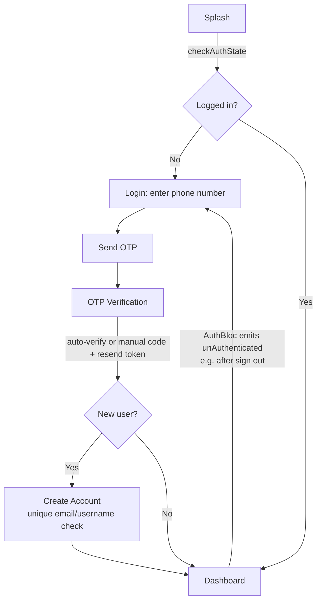

# Screen & Navigation Flow

## App boot sequence

```
main()
  → Firebase.initializeApp() (lib/firebase_options.dart)
  → initDependencies()        # get_it DI, see design.md
  → runApp(FileFlowApp)
  → MultiBlocProvider(AuthBloc, ThemeCubit)
  → MaterialApp.router(theme/darkTheme/themeMode from ThemeCubit, routerConfig: AppRoute.routes)  # go_router, initialLocation = Splash
```

## Route table

Flat declarative routes (`lib/core/routes/app_route.dart`) — no nested/shell routes:

| Route | Screen |
|---|---|
| `/` (splash) | `SplashScreen` |
| login | `LoginScreen` |
| OTP verification | `OtpVerificationScreen` |
| create account | `CreateAccountScreen` |
| dashboard | `DashboardScreen` |
| home | `HomeScreen` |
| folder details | `FolderDetailsScreen` |
| upload | `UploadScreen` |
| devices | `DevicesScreen` |
| edit profile | `CreateAccountScreen` (`editRouteName`, same screen in edit mode) |

`HomeScreen`, `UploadScreen`, and `ProfileScreen` are also embedded directly as pages inside `DashboardScreen`'s tab `PageView` — they're reachable both as standalone routes and as dashboard tabs.

## Auth flow



- `SplashScreen` calls `CheckAuthStatusUsecase` on load to decide whether to route to `Login` or straight to `Dashboard`.
- `LoginScreen` collects a phone number and calls `SendOtpUsecase`.
- `OtpVerificationScreen` supports both Firebase's auto-verification callback and manual 6-digit entry, plus a resend flow using Firebase's resend token.
- New accounts go through `CreateAccountScreen`, which validates that email and username are unique against Firestore before writing the new `users/{uid}` document (with a default 5 GiB storage limit).
- `AuthBloc` is the single source of truth for auth status app-wide. Screens don't poll it directly for redirects — e.g. `DashboardScreen` wraps its body in a `BlocListener<AuthBloc, AuthState>` that calls `context.go(LoginScreen.routeName)` whenever status flips to `unAuthenticated` (this is how sign-out, from any device-management action, kicks the user back to Login).

## Dashboard shell

`DashboardScreen` is **not** a go_router shell/nested route — it's a single screen containing its own `PageView` (non-swipeable, `NeverScrollableScrollPhysics`) and a custom bottom nav bar, switching pages by index via a `ValueNotifier<int>`:

| Index | Tab | Content |
|---|---|---|
| 0 | Home | `HomeScreen` — category browsing UI (static) |
| 1 | Sharing | placeholder `Text('Sharing')` — not implemented |
| 2 | Upload | `UploadScreen` — also reachable via the center floating action button |
| 3 | Settings | placeholder `Text('Coming Soon')` — not implemented |
| 4 | Profile | `ProfileScreen` |

The center FAB jumps to the Upload tab (index 2) and plays a 20-second spinning gradient animation (`Future.delayed(const Duration(seconds: 20))`) before stopping — this is placeholder/demo animation code, **not** real upload progress tracking (there's no actual upload happening yet).

## Profile & device management flow

```
ProfileScreen → DevicesScreen
  DevicesBloc streams:
    - watchDevices(uid)                       → list of all known devices
    - watchCurrentDeviceActiveStatus(uid, id)  → whether *this* session is still active
  Actions:
    - log out a single device (logoutDevice)
    - log out all other devices (logoutAllOtherDevices)
    - sign out of the current device (AuthBloc → signOut) → status becomes unAuthenticated
                                                            → Dashboard's listener redirects to Login
```

If the current device is remotely logged out from another session (its `isActive` flips to `false` in Firestore), `watchCurrentDeviceActiveStatus` picks that up and the same sign-out/redirect path applies.

## Edit profile & theme switching

```
ProfileScreen
  → push(CreateAccountScreen.editRouteName)
      CreateAccountScreen(isEditMode: true)   # detected from AuthBloc's already-loaded user
      → UpdateProfileUsecase(uid, displayName, username, email, photoUrl)
      → pop back to ProfileScreen
  → ThemeModeSelector (Appearance row)
      → ThemeCubit.updateMode(mode)
      → if brightness actually changes (light↔dark), ThemeRevealController.toggleWithReveal
        plays a circular-reveal animation from the tap origin before/while applying the new theme
```

`ProfileScreen` also renders the user's avatar via the shared `UserAvatar` widget (network photo, local file, or initials/icon fallback) and a storage-usage summary alongside these actions.

## What's UI-only today

Tapping through Home → category chips → folder cards → `FolderDetailsScreen`, or through the Upload screen's file picker and "Upload File" button, shows the intended UI but doesn't read or write any real file data — there's no Firestore/Storage wiring behind these screens yet (see [`README.md`](README.md#current-status) and [`design.md`](design.md#explicitly-not-designed-yet)).
